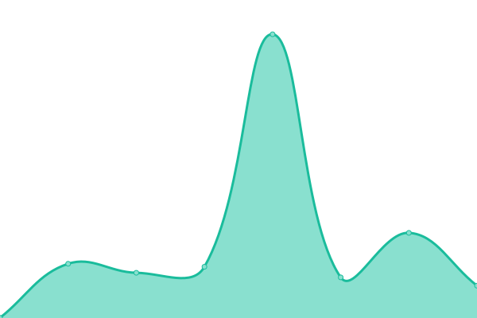
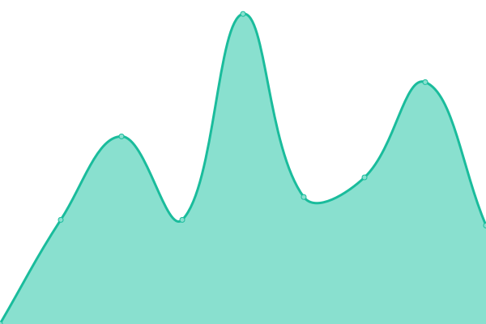

# [📈 Live Status](https://uptime.shoogland.com): <!--live status--> **🟩 All systems operational**

This repository contains the open-source uptime monitor and status page for [Stephan Hoogland](https://www.shoogland.com/), powered by [Upptime](https://github.com/upptime/upptime).

With [Upptime](https://upptime.js.org), you can get your own unlimited and free uptime monitor and status page, powered entirely by a GitHub repository. We use [Issues](https://github.com/shoogland/upptime/issues) as incident reports, [Actions](https://github.com/shoogland/upptime/actions) as uptime monitors, and [Pages](https://uptime.shoogland.com) for the status page.

<!--start: status pages-->
<!-- This summary is generated by Upptime (https://github.com/upptime/upptime) -->
<!-- Do not edit this manually, your changes will be overwritten -->
<!-- prettier-ignore -->
| URL | Status | History | Response Time | Uptime |
| --- | ------ | ------- | ------------- | ------ |
|  [SHoogland.com](https://www.shoogland.com) | 🟩 Up | [s-hoogland-com.yml](https://github.com/SHoogland/upptime/commits/HEAD/history/s-hoogland-com.yml) | 

 468ms
     
 | 

<a href="https://uptime.shoogland.com/history/s-hoogland-com">99.67%</a>
    

|  [Timmerdorp](https://timmerdorp.com) | 🟩 Up | [timmerdorp.yml](https://github.com/SHoogland/upptime/commits/HEAD/history/timmerdorp.yml) | 

 298ms
     
 | 

<a href="https://uptime.shoogland.com/history/timmerdorp">100.00%</a>
    

|  [Timmerdorp shop](https://shop.timmerdorp.com) | 🟩 Up | [timmerdorp-shop.yml](https://github.com/SHoogland/upptime/commits/HEAD/history/timmerdorp-shop.yml) | 

 327ms
     
 | 

<a href="https://uptime.shoogland.com/history/timmerdorp-shop">100.00%</a>
    

|  [Timmerdorp wordpress](https://wordpress.timmerdorp.com/wp-json/wp/v2/posts) | 🟩 Up | [timmerdorp-wordpress.yml](https://github.com/SHoogland/upptime/commits/HEAD/history/timmerdorp-wordpress.yml) | 

 1630ms
     
 | 

<a href="https://uptime.shoogland.com/history/timmerdorp-wordpress">100.00%</a>
    

|  [Tdorp.nl](https://tdorp.nl) | 🟩 Up | [tdorp-nl.yml](https://github.com/SHoogland/upptime/commits/HEAD/history/tdorp-nl.yml) | 

 307ms
     
 | 

<a href="https://uptime.shoogland.com/history/tdorp-nl">100.00%</a>
    

|  [MyDashboard - Ping/backgroundJob](https://us-central1-my-dashboard-firebase.cloudfunctions.net/ping) | 🟩 Up | [my-dashboard-ping-background-job.yml](https://github.com/SHoogland/upptime/commits/HEAD/history/my-dashboard-ping-background-job.yml) | 

 548ms
     
 | 

<a href="https://uptime.shoogland.com/history/my-dashboard-ping-background-job">100.00%</a>
    

|  [MyDashboard](https://mydashboard.shld.nl) | 🟩 Up | [my-dashboard.yml](https://github.com/SHoogland/upptime/commits/HEAD/history/my-dashboard.yml) | 

 355ms
     
 | 

<a href="https://uptime.shoogland.com/history/my-dashboard">100.00%</a>
    

|  [Boblevering.nl](https://boblevering.nl) | 🟩 Up | [boblevering-nl.yml](https://github.com/SHoogland/upptime/commits/HEAD/history/boblevering-nl.yml) | 

 227ms
     
 | 

<a href="https://uptime.shoogland.com/history/boblevering-nl">100.00%</a>
    

|  [Scouting Rurik](https://www.scoutingrurik.nl/) | 🟩 Up | [scouting-rurik.yml](https://github.com/SHoogland/upptime/commits/HEAD/history/scouting-rurik.yml) | 

 1347ms
     
 | 

<a href="https://uptime.shoogland.com/history/scouting-rurik">99.91%</a>
    

<!--end: status pages-->

[**Visit our status website →**](https://uptime.shoogland.com)

## 📄 License

- Powered by: [Upptime](https://github.com/upptime/upptime)
- Code: [MIT](./LICENSE) © [Stephan Hoogland](https://www.shoogland.com/)
- Data in the `./history` directory: [Open Database License](https://opendatacommons.org/licenses/odbl/1-0/)
